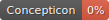
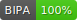
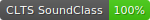

# ideobank

## How to cite

If you use these data please cite
this dataset using the DOI of the [particular released version](../../releases/) you were using

## Description

This dataset is licensed under a CC-BY-4.0 license

## Statistics

- **Varieties:** 62 (linked to 62 different Glottocodes)
- **Concepts:** 2,931 (linked to 0 different Concepticon concept sets)
- **Lexemes:** 3,621
- **Sources:** 53
- **Synonymy:** 1.08
- **Invalid lexemes:** 0
- **Tokens:** 16,129
- **Segments:** 189 (0 BIPA errors, 0 CLTS sound class errors, 189 CLTS modified)
- **Inventory size (avg):** 21.18

## Possible Improvements:

- Entries missing sources: 645/3621 (17.81%%)

# Contributors

Name | GitHub user | Description | Role |
--- | --- | --- | --- |
Roberto Zariquiey | @rzariquiey | creator, data collection | Author |
Jaime Montoya | @jaimerafaelms | data collection | Author |
Frederic Blum | @FredericBlum | CLDF conversion | Other |

## CLDF Datasets

The following CLDF datasets are available in [cldf](cldf):

- CLDF [Wordlist](https://github.com/cldf/cldf/tree/master/modules/Wordlist) at [cldf/cldf-metadata.json](cldf/cldf-metadata.json)